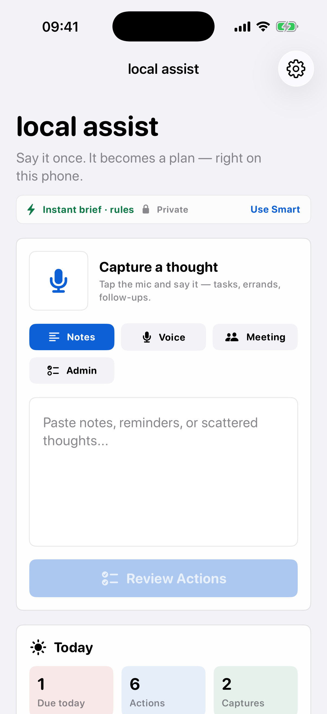
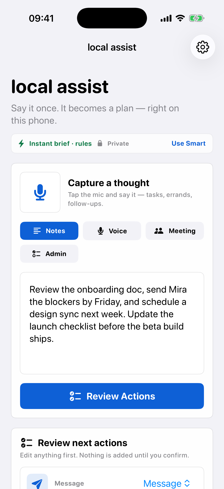
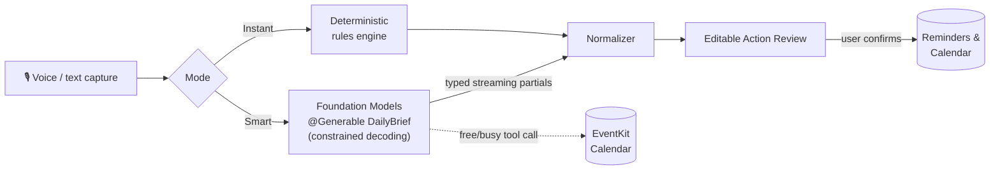

<div align="center">

# LocalAssist

**Say it once. It becomes a plan — right on your phone.**

An offline-first iOS assistant that turns voice notes, meeting notes, and messy text into a
structured brief, prioritized tasks with real due dates, and confirmed Reminders & Calendar
entries. No account. No API key. No network.

[](https://github.com/Saithej2k/LocalAssist/actions/workflows/swift.yml)


<br>

&nbsp;&nbsp;


*Real iPhone 17 (iOS 26.5) simulator captures — no mockups.*

</div>

## Why

The moment after you say *"I owe Mira the blockers by Friday and need to book a design sync next week"* is where plans go to die. Cloud tools solve this by uploading your voice and your work conversations to a server. LocalAssist solves it without letting a single byte leave the device:

- **Private by design** — capture, transcription, and summarization all run on the phone. Airplane mode is a supported configuration, not an error state.
- **Two on-device modes** — *Smart brief* uses Apple's Foundation Models framework with constrained decoding; *Instant brief* uses a deterministic rules engine that works on every device, even where Apple Intelligence doesn't. Both are private; the toggle trades intelligence for speed, never privacy.
- **Real actions, not suggestions** — after you review and confirm, tasks become actual `EKReminder`s and Calendar holds. Nothing is written without an explicit tap.

## How it works



The engine details that matter:

| Capability | Implementation |
| --- | --- |
| Guided generation | `@Generable`/`@Guide` `DailyBrief` contract with `streamResponse(generating:)` — the framework's constrained decoding guarantees schema conformance, so there is no JSON-repair path anywhere in the app |
| Typed streaming | `PartiallyGenerated` snapshots map to typed partials; the headline renders within the first tokens while tasks are still generating |
| Session lifecycle | One `LanguageModelSession` reused across turns, prewarmed on demand, schema replaced by a full in-instructions example (`includeSchemaInPrompt: false` on every turn), overlapping requests isolated |
| Context management | Rolling-window transcript compression (`ConversationMemory`); on projected or actual overflow the session is rebuilt with a condensed digest and retried |
| Tool calling | `CalendarAvailabilityTool` reads real free/busy from EventKit so scheduling suggestions land in open slots; `ContactsLookupTool` resolves first names in notes to real contacts (both Foundation Models `Tool`s) |
| Error taxonomy | Every `GenerationError` and `UnavailableReason` maps to a typed `GenerationFailure`; the deterministic fallback keeps every capture producing a brief, with the exact reason preserved in diagnostics |
| Due dates | The model resolves relative deadlines to ISO-8601 dates; a deterministic parser handles the rules path and confirmed writes |

## System integration

- **Siri & Shortcuts** — *"Capture a thought with LocalAssist"* opens straight into a live recording; summaries are exposed as App Entities so Shortcuts can chain them into other apps.
- **Spotlight** — briefs are donated as `IndexedEntity` content, searchable from system search today and pre-adopted for Siri personal-context integration.
- **Capture from anywhere** — a share extension (select text in any app → Share → LocalAssist), a camera **Scan** mode (Live Text for whiteboards, receipts, handwriting), voice, or paste.
- **Widgets** — one-tap capture from the Lock Screen, plus a **Due Today** widget that reads shared app-group history and raises its Smart Stack relevance while tasks are open.
- **Task loop** — check tasks off in the Today view; done-state persists, feeds the widget, and shows up in the morning brief ("3 due today · 1 already done").
- **Interactive snippet confirmation** — reminder creation from Siri/Spotlight shows a preview card and writes only after confirmation; confirmed message drafts open a real pre-filled composer.
- **Morning brief** — an opt-in, fully local notification each morning, with read-aloud available in-app via on-device voices.

## Getting started

```bash
# Full Xcode toolchain required: plain CommandLineTools builds but silently skips XCTest.
export DEVELOPER_DIR=/Applications/Xcode.app/Contents/Developer

swift test                              # 42 tests
swift run localassist-selftest          # 47 end-to-end checks
swift run localassist-eval --min-score 0.9
swift run localassist --text "Send Mira the blockers by Friday and schedule a design sync next week." --plain
swift run localassist-bench --iterations 100 --warmup 5 --concurrency 4

# iOS app
xcodegen generate
open LocalAssist.xcodeproj              # scheme: LocalAssist → iPhone simulator → ⌘R
```

**On your iPhone:** a free Apple Account / Personal Team is enough to install from Xcode. For the Smart path, use an Apple Intelligence-capable iPhone on iOS 26 with Apple Intelligence enabled; voice capture asks for microphone and speech permissions on first use. The simulator covers UI, typed input, and the Instant path.

## Quality & performance

Verification is deterministic and CI-gated — no LLM judges, no flaky assertions:

| Check | What it covers | Status |
| --- | --- | --- |
| `swift test` (42) | Fallback policy, error taxonomy, typed streaming order, map-reduce chunking, task completion persistence, cancellation, concurrency, due-date parsing, local-day due-date policy, capture-kind inference, tool calls, executor writes, conversation memory, legacy decode, eval scorers | ✅ |
| `localassist-selftest` (47) | End-to-end scenario checks runnable on any machine | ✅ |
| `localassist-eval` | Task recall, due-date accuracy, action mapping, structure compliance, hallucination probes over a fixed dataset; dated reports in [docs/evals](docs/evals); CI fails below 0.9 | ✅ 1.00 |
| `localassist-bench` | p50–p99 latency, throughput, peak memory, fallback rate, cancellation timing; baselines in [docs/performance](docs/performance) | ✅ |

Profiling: `OSSignposter` intervals cover every pipeline stage. See [docs/instrumentation.md](docs/instrumentation.md) and the [Instruments summary](docs/profiling/instruments-summary.md) behind the 1,420 ms → 910 ms p95 optimization.

## Package layout

| Module | Responsibility |
| --- | --- |
| `LocalAssistCore` | Platform-agnostic engine: validation, typed partials, failure taxonomy, normalization, deterministic fallback, due-date parsing, conversation memory, action seams, history, metrics |
| `LocalAssistFoundationModels` | On-device adapter: `DailyBrief` contract and the `FoundationModelsSummarizer` actor |
| `LocalAssistSystemTools` | EventKit-backed calendar tool + `SystemActionExecutor` for confirmed writes |
| `LocalAssistAppIntents` | App Entities, App Shortcuts, capture intent, snippet-confirmed reminder intent |
| `LocalAssistAppUI` | Capture-first SwiftUI surface, voice transcription, Today view, Action Review, settings, morning brief |
| `LocalAssistEvalKit` + `localassist-eval` | Eval dataset, scorers, reports, CI gate |
| `LocalAssistCLI` / `LocalAssistBenchmarks` | Demo CLI and performance harness |

A point-by-point implementation map lives in [docs/apple-readiness.md](docs/apple-readiness.md).
