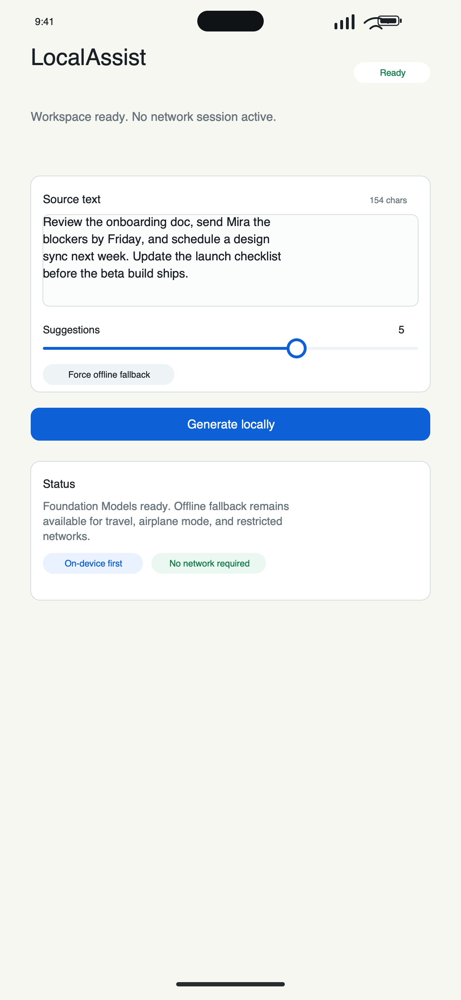
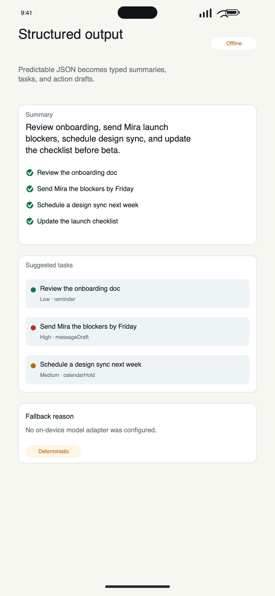
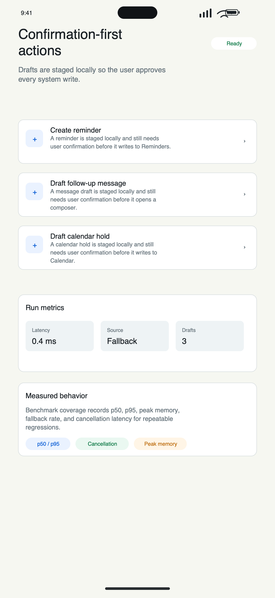
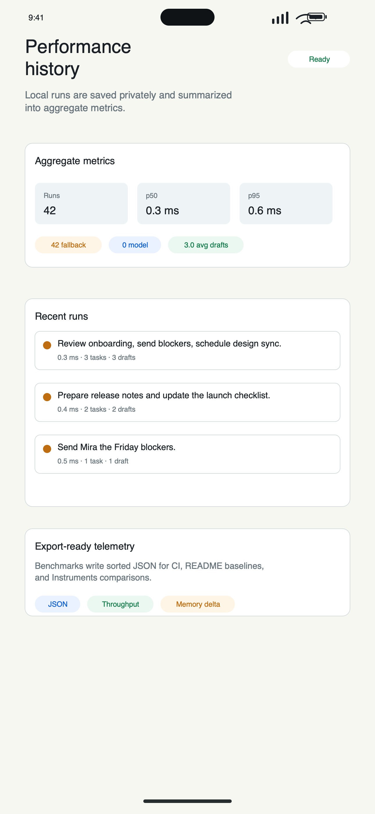

# LocalAssist

LocalAssist is an on-device intelligent task assistant for Apple platforms. It turns messy notes, emails, and meeting transcripts into structured summaries, prioritized task suggestions, and draft system actions without requiring a network connection.

The project is built as a Swift Package so the core workflow, SwiftUI app surface, Foundation Models adapter, App Intents integration, CLI, benchmarks, and tests can all be verified from source.

## iOS Screenshots









Real iOS 26.5 simulator captures are in [`docs/screenshots/simulator`](docs/screenshots/simulator), including a live Foundation Models streaming pass and the final validated summary/action-draft state.

## Highlights

- Uses the local Foundation Models framework when it is available on the device.
- Falls back to a deterministic offline summarizer when the model is unavailable, cancelled, or produces malformed output.
- Streams Foundation Models responses into transient UI state and only commits the final result after guided JSON validation.
- Guides output into a strict JSON contract before normalizing the result into typed Swift models.
- Produces tool-assisted action drafts for reminders, calendar holds, and follow-up messages.
- Persists local run history and computes aggregate p50/p95/source/draft metrics on device.
- Ships a SwiftUI iOS app surface with model availability, offline fallback, cancellation, structured results, action drafts, run metrics, and history.
- Includes XCTest coverage for malformed inputs, availability checks, streaming partials, concurrent requests, cancellation, offline execution, and deterministic fallback behavior.
- Includes a benchmark harness and Instruments workflow notes for p50, p75, p90, p95, p99, throughput, peak memory, memory delta, fallback rate, and cancellation behavior.

## Quick Start

```bash
swift test
swift run localassist-selftest
swift run localassist --text "Review the onboarding doc, send Mira the blockers by Friday, and schedule a design sync next week."
swift run localassist-bench --iterations 100 --warmup 5 --concurrency 4 --json --output docs/performance/latest.json
node Tools/Screenshots/render-screenshots.js
xcodegen generate
env -u LD -u LDFLAGS DEVELOPER_DIR=/Applications/Xcode.app/Contents/Developer xcodebuild -project LocalAssist.xcodeproj -scheme LocalAssist -destination 'platform=iOS Simulator,name=iPhone 17,OS=26.5' CODE_SIGNING_ALLOWED=NO build
```

## Package Layout

- `LocalAssistCore`: validation, guided generation, fallback summarization, tool drafts, and workflow orchestration.
- `RunHistoryStore`: JSON-backed local persistence for private run history.
- `MetricDistribution`: shared percentile and aggregate metric calculations.
- `LocalAssistFoundationModels`: adapter around Apple's on-device `LanguageModelSession`.
- `LocalAssistAppIntents`: system integration through summary, reminder-draft, and recent-run App Intents.
- `LocalAssistAppUI`: reusable SwiftUI surface for the iOS app.
- `LocalAssistCLI`: local demo executable.
- `LocalAssistBenchmarks`: lightweight latency and cancellation harness.
- `LocalAssistCoreTests`: deterministic XCTest suite.

## Apple Readiness

See [docs/apple-readiness.md](docs/apple-readiness.md) for a point-by-point implementation map, [docs/performance/2026-07-01-baseline.md](docs/performance/2026-07-01-baseline.md) for the latest local benchmark summary, and [docs/performance/2026-07-01-benchmark.json](docs/performance/2026-07-01-benchmark.json) for machine-readable telemetry.

## Example

```json
{
  "overview": "Review onboarding material, send blockers, and schedule a design sync.",
  "keyPoints": [
    "Review the onboarding doc",
    "Send Mira the blockers by Friday",
    "Schedule a design sync next week"
  ],
  "suggestions": [
    {
      "title": "Send Mira the blockers",
      "priority": "high",
      "action": "messageDraft",
      "dueHint": "Friday"
    }
  ]
}
```

## Instruments

See [docs/instrumentation.md](docs/instrumentation.md) for the profiling workflow and [docs/profiling/instruments-summary.md](docs/profiling/instruments-summary.md) for the Xcode Instruments summary behind the 1,420 ms to 910 ms p95 optimization.
